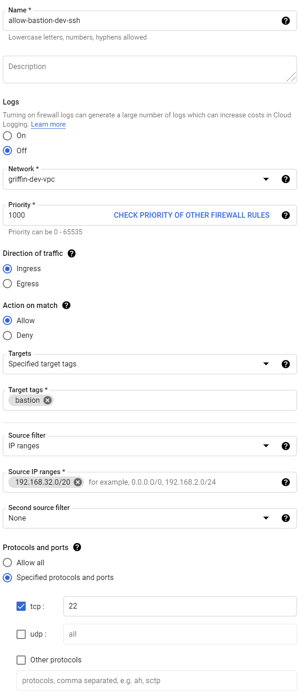
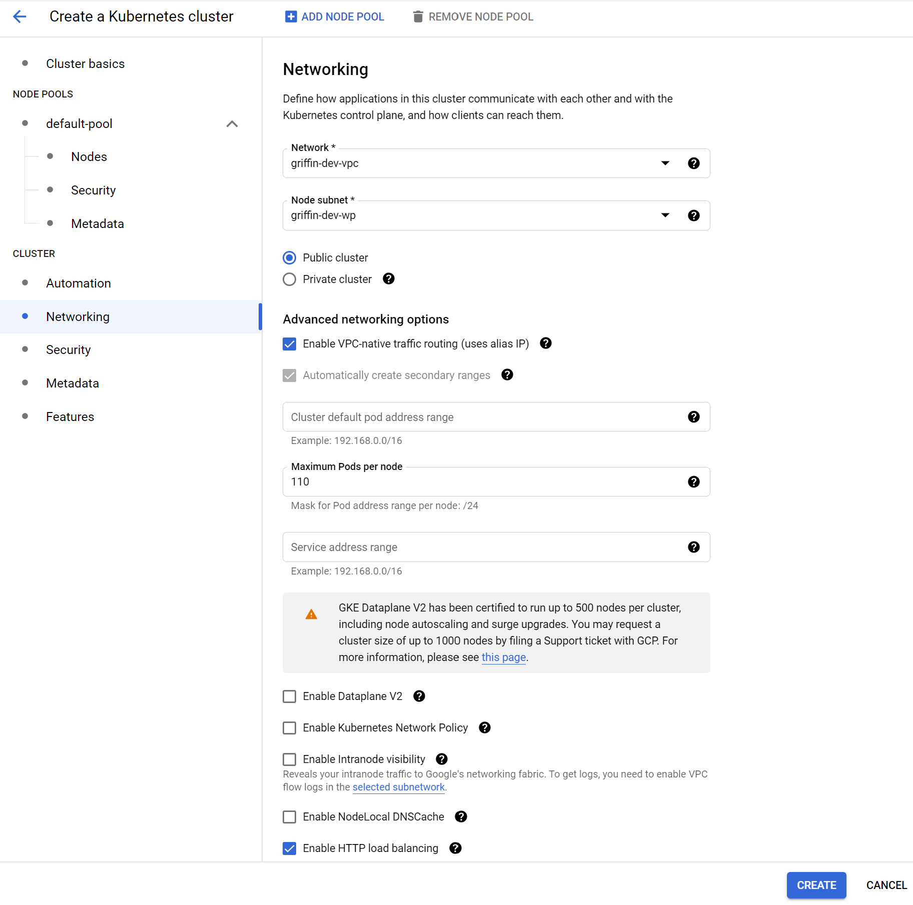
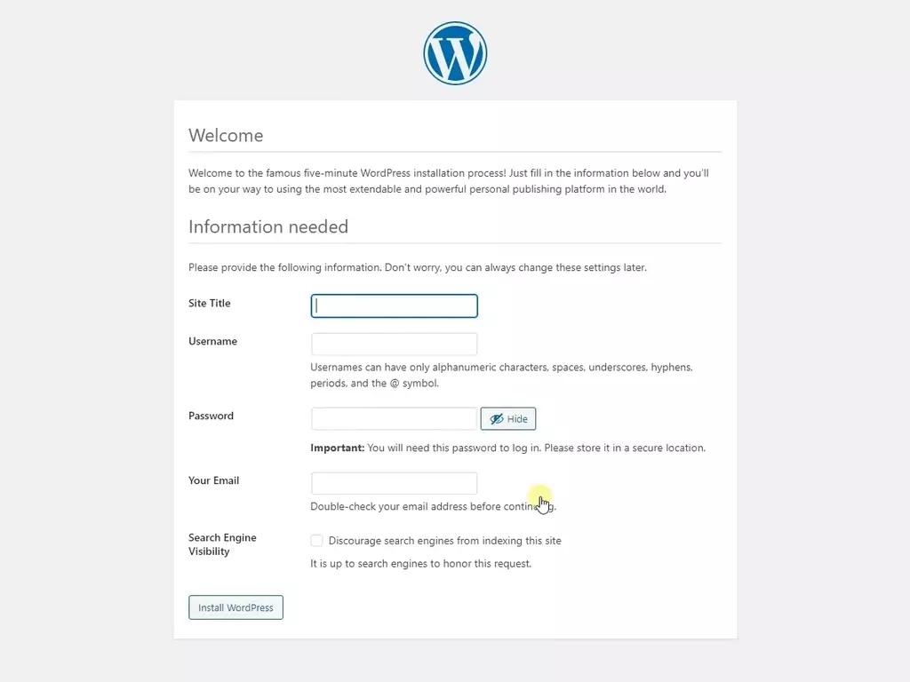

# Set up and Configure a Cloud Environment in Google Cloud: Challenge Lab

## Task 1: Create development VPC manually

- Make sure you create all resources in the us-east1 region and us-east1-b zone.
- In the Google Cloud Console, navigate to VPC network > VPC networks
- Click on Create VPC network.
- Enter `griffin-dev-vpc` to the Name field.
  Select Custom for the Subnet creation mode.
- Add griffin-dev-wp subnet with the following parameters:

```
Name:       griffin-dev-wp
Region:     us-east1
IP address range:   192.168.16.0/20
```

- Click + Add subnet and add `griffin-dev-mgmt` subnet with the following parameters:

```
Name:       griffin-dev-mgmt
Region:     us-east1
IP address range:   192.168.32.0/20
```

- Click Create.

## Task 2: Create production VPC using Deployment Manager

- Copy the Deployment Manager configuration files to Cloud Shell using the following command:

```
gsutil cp -r gs://cloud-training/gsp321/dm ~/
```

- Edit prod-network.yaml configuration file

```
cd dm
vim prod-network.yaml
```

- Replace `SET_REGION` to `us-east1` in the editor, and then press Esc + :wq then hit Enter to save the change.
- Go back to the Cloud Shell, use the following command to create the production VPC network with the configuration files:

```
gcloud deployment-manager deployments create griffin-prod --config prod-network.yaml
```

- Go back to the Cloud Console, navigate to Deployment Manager to confirm the deployment.

## Task 3: Create bastion host

- In the Cloud Console, navigate to Compute Engine > VM instances.
- Click Create.
- Use the following parameters to create the bastion host:

```
Name:       griffin-dev-db
Region:     us-east1
```

- Expand the Management, security, disks, networking, sole tenancy section.
- In the Networking tab, add bastion to the Network tags.
- Click Add network interface, make sure that you set up two Network interfaces,
  `griffin-dev-mgmt` and `griffin-prod-mgmt`

- Click Create.
- Navigate to VPC network > Firewall.
- Click CREATE FIREWALL RULE.

- Configure the rule with the following parameters:

```
Name:       allow-bastion-dev-ssh
Network:    griffin-dev-vpc
Targets:    bastion
Source IP ranges:       192.168.32.0/20
Protocols and ports:    tcp: 22
```

- Click CREATE.
- Click CREATE FIREWALL RULE again.
- Configure another rule with the following parameters:

```
Name:       allow-bastion-prod-ssh
Network:    griffin-prod-vpc
Targets:    bastion
Source IP ranges:       192.168.48.0/20
Protocols and ports:    tcp: 22
```

- Click CREATE.

# 

## Task 4: Create and configure Cloud SQL Instance

- In the Cloud Console, navigate to SQL.
- Click CREATE INSTANCE.
- Click Choose MySQL.
- Use the following parameters to create the instance:

```
Name:       griffin-dev-db
Region:     us-east1
Zone:       us-east1-b
Root password:  e.g. 12345
```

- Click Create.
- Click the `griffin-dev-db` in the SQL pane after it has been created.
- Under Connect to this instance, click on Connect using Cloud Shell then you'll be redirected to shell and then hit Enter.

or

Go back to the Cloud Shell, run:

```
gcloud sql connect griffin-dev-db --user=root --quiet
```

- Enter the Root password.
- In the SQL console, run the following query to create the wordpress database:

```
  CREATE DATABASE wordpress;
   GRANT ALL PRIVILEGES ON wordpress.* TO "wp_user"@"%" IDENTIFIED BY "stormwind_rules";
   FLUSH PRIVILEGES;
```

- Enter exit to quit the SQL shell.

## Task 5: Create Kubernetes cluster

Create a `2 node cluster (n1-standard-4)` called `griffin-dev`, in the `griffin-dev-wp` subnet, and in the zone `us-east1-b`.

- In the Cloud Console, navigate to Kubernetes Engine > Clusters.
- Click Create cluster.
- In the Cluster basics tab, configure:

```
Name: griffin-dev
Zone: us-east1-b
```

- In the left pane, click default-pool under NODE POOLS and set

```
Number of nodes: 2
```

- Click Nodes Under default-pool, and set

```
Machine type: n1-standard-4
```

- Go to the Network tab, set

```
Network: griffin-dev-vpc
Node subnet: griffin-dev-wp
```

- Click CREATE

# 

## Task 6: Prepare the Kubernetes cluster

- In the Cloud Shell, use the following command to copy the files for the Kubernetes:

```
gsutil cp -r gs://cloud-training/gsp321/wp-k8s ~/
```

- Open wp-k8s/wp-env.yaml with the Cloud Shell Editor.

```
cd ~/wp-k8s
vim wp-env.yaml
```

- Press i to Insert and Replace `username_goes_here` and `password_goes_here` to `wp-user` and `stormwind_rules`, respectively.
- Save the file by pressing Esc and then :wq + Enter.
- After the Kubernetes cluster has been created, click on the Connect button.
- Run the following command to connect the cluster:

```
gcloud container clusters get-credentials griffin-dev --zone=us-east1-b
```

- Deploy the configuration to the cluster using:

```
kubectl apply -f wp-env.yaml
```

-Use the command below to create the key, and then add the key to the Kubernetes environment:

```
  gcloud iam service-accounts keys create key.json \
       --iam-account=cloud-sql-proxy@$GOOGLE_CLOUD_PROJECT.iam.gserviceaccount.com
   kubectl create secret generic cloudsql-instance-credentials \
       --from-file key.json
```

## Task 7: Create a WordPress deployment

- Open wp-k8s/wp-deployment.yaml with the Cloud Shell Editor

```
cd ~/wp-k8s
edit wp-deployment.yaml
```

- Replace `YOUR_SQL_INSTANCE` with `griffin-dev-db` Instance connection name.

# 

- Save the file change.
- Go back to the Cloud Shell, run the following commands:

```
kubectl create -f wp-deployment.yaml
kubectl create -f wp-service.yaml
```

- Copy the External IP of the deployed wordpress service and open it in your browser.
  If External IP is not avaiable wait for around 50 seconds and run below command again.
  Sometimes browser may show up some error in that case use the given ports along side the external IP.

```
kubectl get service wordpress
```

# 

## Task 8: Enable monitoring

- Go back to the Cloud Console, and navigate to Monitoring.
- In the Monitoring console, click Uptime checks in the left pane.
- Click CREATE UPTIME CHECK.
- Configure using the following parameters:
- Click SAVE.

```
Title:          WordPress Uptime
Check Type:     TCP
Resource Type:  URL
Hostname:       External IP
Port:           80

External IP will the same you copied in task 7.
```

## Task 9: Provide access for an additional engineer

- In the Cloud Console, navigate to IAM & Admin > IAM.
- Click +ADD.
- In the Add members to … pane, copy and paste the second user account for the lab to the New members field.
- In the Role dropdown, select Project > Editor.
- Click SAVE.

### End the lab once you get the score 100/100 :)
